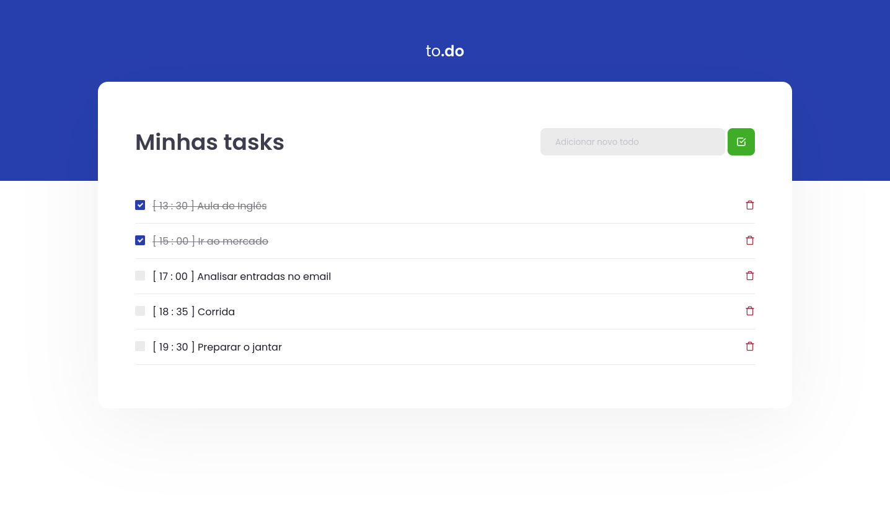

	

		
	

	

		
		
		
		
	

	

		
		
	

# Task List

This is the fifth project of école 42 projects. 
This project is a very small 2D game. It is built to make you work with textures, sprites. And some very basic gameplay elements.